<!-- DOCSIBLE START -->

# 📃 Role overview

## acme

This role is to install [acme.sh](https://acme.sh) and conifgure with vault pki.

| Field                | Value           |
|--------------------- |-----------------|
| Readme update        | 2026/03/13 |

### Tasks

#### File: tasks/main.yml

| Name | Module | Has Conditions |
| ---- | ------ | -------------- |
| Acme ¦ Create group | ansible.builtin.group | False |
| Acme ¦ Create user | ansible.builtin.user | False |
| Acme ¦ Check if acme is installed yet | ansible.builtin.stat | False |
| Acme ¦ Create directory | ansible.builtin.file | True |
| Acme ¦ Download acme.sh | ansible.builtin.git | True |
| Acme ¦ Install acme.sh | ansible.builtin.command | True |
| Acme ¦ Set PDNS & discord config | ansible.builtin.blockinfile | False |
| Acme ¦ check for account config | ansible.builtin.stat | False |
| Acme ¦ Get new EAB keys from vault | community.hashi_vault.vault_write | True |
| Acme ¦ Register account | ansible.builtin.command | True |
| Acme ¦ Register acme service | ansible.builtin.copy | False |
| Acme ¦ Register acme timer | ansible.builtin.copy | False |

## Task Flow Graphs

### Graph for main.yml

```mermaid
flowchart TD
Start
classDef block stroke:#3498db,stroke-width:2px;
classDef task stroke:#4b76bb,stroke-width:2px;
classDef includeTasks stroke:#16a085,stroke-width:2px;
classDef importTasks stroke:#34495e,stroke-width:2px;
classDef includeRole stroke:#2980b9,stroke-width:2px;
classDef importRole stroke:#699ba7,stroke-width:2px;
classDef includeVars stroke:#8e44ad,stroke-width:2px;
classDef rescue stroke:#665352,stroke-width:2px;

  Start-->|Task| Acme___Create_group0[acme   create group]:::task
  Acme___Create_group0-->|Task| Acme___Create_user1[acme   create user]:::task
  Acme___Create_user1-->|Task| Acme___Check_if_acme_is_installed_yet2[acme   check if acme is installed yet]:::task
  Acme___Check_if_acme_is_installed_yet2-->|Task| Acme___Create_directory3[acme   create directory<br>When: **not acme stat exists**]:::task
  Acme___Create_directory3-->|Task| Acme___Download_acme_sh4[acme   download acme sh<br>When: **not acme stat exists**]:::task
  Acme___Download_acme_sh4-->|Task| Acme___Install_acme_sh5[acme   install acme sh<br>When: **not acme stat exists**]:::task
  Acme___Install_acme_sh5-->|Task| Acme___Set_PDNS___discord_config6[acme   set pdns   discord config]:::task
  Acme___Set_PDNS___discord_config6-->|Task| Acme___check_for_account_config7[acme   check for account config]:::task
  Acme___check_for_account_config7-->|Task| Acme___Get_new_EAB_keys_from_vault8[acme   get new eab keys from vault<br>When: **not acme account stat exists**]:::task
  Acme___Get_new_EAB_keys_from_vault8-->|Task| Acme___Register_account9[acme   register account<br>When: **not acme account stat exists**]:::task
  Acme___Register_account9-->|Task| Acme___Register_acme_service10[acme   register acme service]:::task
  Acme___Register_acme_service10-->|Task| Acme___Register_acme_timer11[acme   register acme timer]:::task
  Acme___Register_acme_timer11-->End
```

#### Dependencies

No dependencies specified.
<!-- DOCSIBLE END -->
