<!-- DOCSIBLE START -->

# 📃 Role overview

## acme

| Field                | Value           |
|--------------------- |-----------------|
| Readme update        | 2026/03/13 |

### Tasks

#### File: tasks/main.yml

| Name | Module | Has Conditions |
| ---- | ------ | -------------- |
| Create group | ansible.builtin.group | False |
| Create user | ansible.builtin.user | False |
| Check if acme is installed yet | ansible.builtin.stat | False |
| Create directory | ansible.builtin.file | True |
| Download acme.sh | ansible.builtin.git | True |
| Install acme.sh | ansible.builtin.command | True |
| Set PDNS & discord config | ansible.builtin.blockinfile | False |
| Check for account config | ansible.builtin.stat | False |
| Get new EAB keys from vault | community.hashi_vault.vault_write | True |
| Register account | ansible.builtin.command | True |
| Register acme service | ansible.builtin.copy | False |
| Register acme timer | ansible.builtin.copy | False |

## Task Flow Graphs

### Graph for main.yml

```mermaid
flowchart TD
Start
classDef block stroke:#3498db,stroke-width:2px;
classDef task stroke:#4b76bb,stroke-width:2px;
classDef includeTasks stroke:#16a085,stroke-width:2px;
classDef importTasks stroke:#34495e,stroke-width:2px;
classDef includeRole stroke:#2980b9,stroke-width:2px;
classDef importRole stroke:#699ba7,stroke-width:2px;
classDef includeVars stroke:#8e44ad,stroke-width:2px;
classDef rescue stroke:#665352,stroke-width:2px;

  Start-->|Task| Create_group0[create group]:::task
  Create_group0-->|Task| Create_user1[create user]:::task
  Create_user1-->|Task| Check_if_acme_is_installed_yet2[check if acme is installed yet]:::task
  Check_if_acme_is_installed_yet2-->|Task| Create_directory3[create directory<br>When: **not acme stat exists**]:::task
  Create_directory3-->|Task| Download_acme_sh4[download acme sh<br>When: **not acme stat exists**]:::task
  Download_acme_sh4-->|Task| Install_acme_sh5[install acme sh<br>When: **not acme stat exists**]:::task
  Install_acme_sh5-->|Task| Set_PDNS___discord_config6[set pdns   discord config]:::task
  Set_PDNS___discord_config6-->|Task| Check_for_account_config7[check for account config]:::task
  Check_for_account_config7-->|Task| Get_new_EAB_keys_from_vault8[get new eab keys from vault<br>When: **not acme account stat exists**]:::task
  Get_new_EAB_keys_from_vault8-->|Task| Register_account9[register account<br>When: **not acme account stat exists**]:::task
  Register_account9-->|Task| Register_acme_service10[register acme service]:::task
  Register_acme_service10-->|Task| Register_acme_timer11[register acme timer]:::task
  Register_acme_timer11-->End
```

#### Dependencies

No dependencies specified.
<!-- DOCSIBLE END -->
